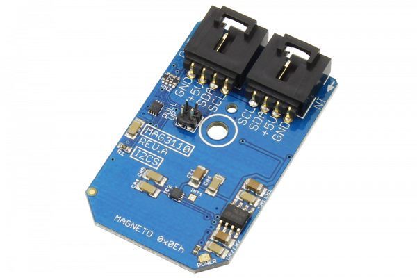

# MAG3110

The MAG3110 is a small, low-power, digital 3-axis magnetometer.This device can be used in conjunction with a 3-axis accelerometer to realize an orientation independent electronic compass that can provide accurate heading information.The MAG3110 is guaranteed to operate over the extended temperature range of -40°C to +85°C
This Device is available from www.ncd.io 

[SKU: MAG3110_I2CS]

(https://store.ncd.io/product/mag3110-3-axis-digital-magnetometer-electronic-compass-i2c-mini-module/)
This Sample code can be used with Arduino.

Hardware needed to interface MAG3110 sensor with Arduino

1. <a href="https://store.ncd.io/product/i2c-shield-for-arduino-nano/">Arduino Nano</a>

2. <a href="https://store.ncd.io/product/i2c-shield-for-arduino-micro-with-i2c-expansion-port/">Arduino Micro</a>

3. <a href="https://store.ncd.io/product/i2c-shield-for-arduino-uno/">Arduino uno</a>

4. <a href="https://store.ncd.io/product/dual-i2c-shield-for-arduino-due-with-modular-communications-interface/">Arduino Due</a>

5. <a href="https://store.ncd.io/product/mag3110-3-axis-digital-magnetometer-electronic-compass-i2c-mini-module/">MAG3110 3Axis Digital Magnetometer Sensor</a>

6. <a href="https://store.ncd.io/product/i%C2%B2c-cable/">I2C Cable</a>

MAG3110:

The MAG3110 is a small, low-power, digital 3-axis magnetometer.This device can be used in conjunction with a 3-axis accelerometer to realize an orientation independent electronic compass that can provide accurate heading information.The MAG3110 is guaranteed to operate over the extended temperature range of -40°C to +85°C

Applications:

• Electronic Compasses

• Location-Based Services

How to Use the MAG3110 Arduino Library

The MAG3110 has a number of settings, which can be configured based on user requirements.
          
1.Address calling:The following command is used to call the address of MAG3110 sensor to begin the transmission.

             mag.getAddr_MAG3110(MAG3110_DEFAULT_ADDRESS_MAG);        // 0x0E
            
2.Sensor set up:The following command is used for set up of magnetometer for the output measurement.

             mag.setUpMagnetometer();
          
3.Output measurement:The following command is used to measure the output of magnetometer.

             mag.Measure_Magnetometer();
